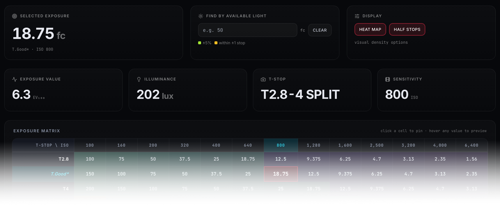

  

# Incident Exposure Calculator

An interactive cinematography exposure table for quickly looking up the incident foot candles needed from the key for many combinations of ISO and T-Stop. Assumes 24 fps (or 23.98) with a 180° shutter angle.

**[Try it live →](https://geoffsmithbk.github.io/incident-exposure/)**

## What It Does

Cross-reference **ISO** (100–6400) with **T-Stop** (T2.8–T22, including half stops) to find the required **incident foot candles** at key for proper exposure.

### Features

- **Click any cell** to highlight the full row and column, with a readout showing the ISO, T-Stop, foot candles, lux equivalent, and approximate EV
- **Find by Available Light** — enter your measured foot candles and the table highlights which ISO/T-Stop combinations will work
- **Heat map** — color-coded from cool (low light) to warm (bright) for quick scanning
- **Half stops** — toggle the intermediate T-Stop rows on or off for a cleaner view

### Common Light Levels

The app includes a reference table of typical incident light levels, from candlelight (~1 fc) through direct sunlight (~5,000 fc).

## Usage

No installation needed. It's a single HTML file with no dependencies.

- **Online:** Visit the [live site](https://geoffsmithbk.github.io/incident-exposure/)
- **Locally:** Open `index.html` in any browser, or serve it with `python3 -m http.server`

## Notes

- Reflected readings are also valid from camera position if made from an 18% grey target
- Adapted from [cinematography.net](https://cinematography.net/edited-pages/exposure.html) (CML) in memory of Geoff Boyle NSC FBKS

## License

MIT
